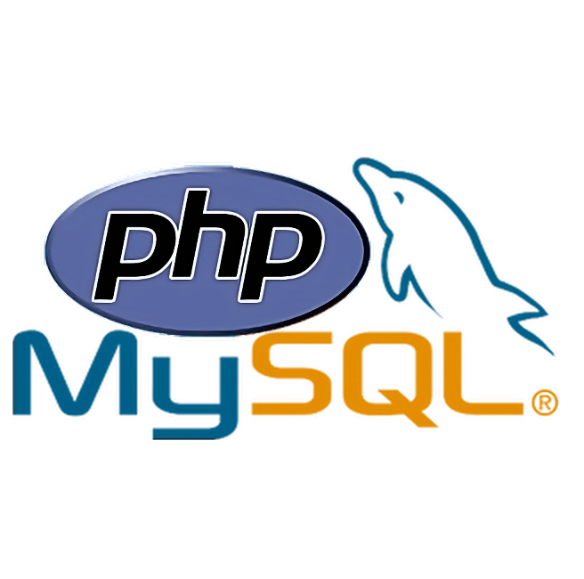

# SQL-PHP IntelliSense

[](https://marketplace.visualstudio.com/items?itemName=Siavash.php-sql-intellisense)

SQL-PHP IntelliSense helps PHP projects write MySQL queries with schema-aware completions, lightweight linting, field hovers, and a quick action for running selected SQL.

The extension connects to your MySQL database, reads table and column metadata, and uses that schema while you edit SQL strings in PHP files.



## Features

- Table-name completion in supported MySQL query strings.
- Field-name completion when the source table can be inferred.
- Diagnostics for table and field names that do not exist in the connected database.
- Hover information for known fields, including the MySQL column type.
- Command palette actions for connecting to MySQL, linting the active file, and clearing stored credentials.
- Code action for running a selected SQL query and viewing results in a VS Code webview.

## Supported PHP Patterns

By default, SQL extraction targets string literals (single or double-quoted) passed to these static calls:

```php
Database::prepare("SELECT id, name FROM users");
Database::getResults("SELECT * FROM users");
Database::getValue("SELECT email FROM users WHERE id = :id");
Database::getRow("SELECT * FROM users WHERE id = :id");
Database::PrepareExecuteTC("SELECT * FROM users");
```

### Customizable Patterns & Heredoc/Nowdoc

You can customize the function and method names that trigger SQL extraction using the `SQL-PHP.Intellisense.extractionPatterns` setting (e.g., adding `$db->query` or `PDO::prepare`).

The extension also automatically detects SQL queries declared in PHP **Heredoc** and **Nowdoc** blocks using `SQL` or `MYSQL` identifiers:

```php
$query = <<<SQL
SELECT id, name
FROM users
WHERE status = 'active'
SQL;
```

Current limitations:

- The extension is optimized for MySQL.
- Dynamically constructed queries (e.g., string concatenation) may not always be fully understood.

## IntelliSense in Action

Below is a conceptual example of the completions, diagnostics, and hovers in action:

```php
// 1. Table Name Completion
Database::prepare("SELECT * FROM |");
//                               ^ Autocomplete triggers: suggests tables ('users', 'products', 'orders')

// 2. Field Name Completion
Database::prepare("SELECT users.| FROM users");
//                              ^ Autocomplete triggers: suggests fields from 'users' table

// 3. Diagnostics & Error Highlighting
Database::prepare("SELECT invalid_field FROM users");
//                        ~~~~~~~~~~~~~ Diagnostic Error: Field name 'invalid_field' not found in table 'users'
```

## Underlying Logic & Algorithmic Design

To provide fast and context-aware SQL tooling directly within PHP files, the extension implements the following pipeline:

1. **SQL Extraction (Pattern Matching):**
   The extension scans the PHP files using optimized regular expressions matching specific static query execution patterns (such as `Database::prepare(...)`).
2. **Context Resolution (Lexical Parsing):**
   When autocompletion is triggered, a custom lexical parser evaluates the SQL string preceding the cursor. It tracks whitespace, punctuation, and keyword structures to identify whether the cursor is in a `table` context or a `field` context, and automatically maps aliases to their respective tables.
3. **AST Construction (SQL Parsing):**
   The extension passes extracting queries to `node-sql-parser` to construct an Abstract Syntax Tree (AST). By analyzing this AST, it resolves the referenced tables and fields to validate query correctness.
4. **Schema Inspection & Caching:**
   Using the configured connection credentials, the extension queries the MySQL database's schema metadata. It caches table names and field maps in-memory to ensure autocomplete suggestions and hover info are displayed with sub-millisecond response times.

## Requirements

- Visual Studio Code `1.84.0` or newer.
- Access to a MySQL database whose schema should power completions and linting.

## Setup

1. Install the extension.
2. Open VS Code settings and configure:
    - `SQL-PHP.Intellisense.database.host`
    - `SQL-PHP.Intellisense.database.port`
    - `SQL-PHP.Intellisense.database.name`
3. Run `SQL-PHP: Connect to MySQL Database` from the command palette.
4. Enter the database username and password when prompted.

Credentials are stored with VS Code SecretStorage. Run `SQL-PHP: Delete Database Credentials` to clear them.

## Commands

| Command                                | Description                                                          |
| -------------------------------------- | -------------------------------------------------------------------- |
| `SQL-PHP: Connect to MySQL Database`   | Connects to the configured MySQL database and loads schema metadata. |
| `SQL-PHP: Lint MySQL Queries`          | Lints SQL queries in the active PHP document.                        |
| `SQL-PHP: Delete Database Credentials` | Removes the stored username and password.                            |

## Extension Settings

| Setting                                  | Default                                                    | Description                                                                                  |
| ---------------------------------------- | ---------------------------------------------------------- | -------------------------------------------------------------------------------------------- |
| `SQL-PHP.Intellisense.database.host`      | `localhost`                                                | MySQL server host name or IP address.                                                        |
| `SQL-PHP.Intellisense.database.port`      | `3306`                                                     | MySQL server port.                                                                           |
| `SQL-PHP.Intellisense.database.name`      | empty                                                      | Name of the MySQL database to inspect.                                                       |
| `SQL-PHP.Intellisense.extractionPatterns` | `["Database::prepare", "Database::getResults", ...]`       | List of PHP method or function names (e.g., `$db->query`) to extract SQL query strings from. |

## Development

```sh
npm install
npm run compile
npm run lint
npm test
```

Package the extension locally with:

```sh
npm run vsce
```

For manual installation from a VSIX file, see the [VSIX installation guide](docs/SQL-PHP%20Extension%20Guide.pdf).

## Roadmap

- Configurable PHP function/method patterns for SQL extraction.
- Better support for single-quoted and multiline SQL strings.
- Workspace-wide linting for PHP files.
- Broader SQL parser coverage for joins, aliases, and dynamic query fragments.

## Contributing

Issues and pull requests are welcome on the [GitHub repository](https://github.com/lightning1377/php-sql-intellisense).

## License

MIT

## Support the Project ⭐

With over **5,000+ active installations** on the VS Code Marketplace, this extension is driven entirely by community utility. If this tool saves you a few context-switches or protects you from a broken query deployment today, please consider supporting its ongoing development:

- **Star this repository** to improve its visibility on GitHub so other developers can discover it.
- **Leave a review** on the [VS Code Marketplace](https://marketplace.visualstudio.com/items?itemName=Siavash.php-sql-intellisense&ssr=false#review-details) sharing your favorite feature or setup.

### Feedback & Contributing

Found a bug or have a feature request? Please feel free to open an issue or submit a pull request. Your feedback helps make local SQL context mapping better for everyone.
